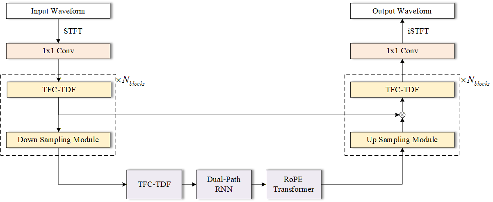

# MSRKit-WHU

This is a repository of Team AC/DC, Wuhan University participating the ICASSP 2026 MSR Challenge.

## System Description

### Directory Structure

We generally inherit the baseline GAN framework, replacing the generator module of our own proposed compose model.

The repository directory structure is:

`MSRKit/`

- `README.md` <- You are here
- `config.yaml` <- Main configuration file for experiments
- `train.py` <- Main script to start training
- `unwrap.py` <- Utility to extract generator weights from a checkpoint
- `data/` <- [Data loading and augmentation](https://github.com/OrigamiShido/MSRKit-WHU/blob/main/data/README.md)
- `losses/` <- [Loss function implementations](https://github.com/OrigamiShido/MSRKit-WHU/blob/main/losses/README.md)
- `models/` <- [Top-level generator model architectures](https://github.com/OrigamiShido/MSRKit-WHU/blob/main/models/README.md)
- `modules/`<-Core building blocks for models
    - `discriminator/` <- Discriminator architectures
    - `generator/` <- Reusable generator components

## Methodology

### Model Description

We inherit the baseline GAN framework, only modified the generator and discriminator settings.

#### generator



Inspired by [1],[2] and [3], we propose a generator model based on DTTNet[2], with modifications similar to [1] and [4], we choose to use STFT spectrum as input giving consideration to precision of reconstruction of non-vocal stems. Instead of replacing the Dual-Path RNN module, we choose to add the RoPE Transformer module to introduce attention mechanism while increasing the overall parameter amount, which we hope to balance phase reconstruction and enabling long-term relevant information preservation, ensuring a better time generalization ability.

#### Discriminator

We use the baseline Multi Frequency Discriminator.

### Dataset Preparation

For now we only use RawStem[3].

### Hyperparameters

We set $N_{blocks}$=2 to balance parameter compression and model performance, and we set

```yaml
model:
  name: "DTTNet"
  params:
    dim_f: 1025
    n_fft: 2048
    hop_length: 512
    audio_ch: 1
    block_type: TFC_TDF_Res2
    num_blocks: 5
    l: 3
    g: 32
    k: 3
    bn: 2
    bias: False
    bn_norm: BN
    sample_rate: 48000
    hidden_channels: 128
    bandsequence:
      rnn_type: LSTM
      bidirectional: True
      num_layers: 4
      n_heads: 2
    RoPEParams:
      depth: 2
      dim_head: 64
      heads: 8
      time_transformer_depth: 2
      freq_transformer_depth: 2
      attn_dropout: 0.1
      ff_dropout: 0.1
      flash_attn: True
```

Detailed hyperparameters can be accessed at `./config_{stem}.yaml`.

### Loss Function

we inherently use the baseline 3 loss functions: Reconstruction Loss, Adversarial Loss and Feature Matching Loss.

## Accessible Code Link

We only distribute the code at [OrigamiShido/MSRKit-WHU: Model Implementations, Evaluation Scripts, etc. for Music Source Restoration Challenge 2025.](https://github.com/OrigamiShido/MSRKit-WHU) and our model at [OrigamiShido/MSRChallenge-ACDC · Hugging Face](https://huggingface.co/OrigamiShido/MSRChallenge-ACDC).

## Instructions for Reproducing

1. Download the code from our repository and install the dependencies.

```bash
git clone https://github.com/OrigamiShido/MSRKit-WHU.git
cd MSRKit-WHU
pip install -r requirements.txt
```

2. Download our distributed weights and configs at [OrigamiShido/MSRChallenge-ACDC · Hugging Face](https://huggingface.co/OrigamiShido/MSRChallenge-ACDC)
3. Start Inference process.

```bash
python inference.py --config config.yaml --checkpoint path/to/your/checkpoint.ckpt --input_dir path/to/your/input/directory --output_dir path/to/your/output/directory
```

2. Calculate the Metrics.

```bash
python calculate_metrics.py {file list}
```

Or you can try to train this model:

```bash
python train.py --config config.yaml
```

And try to find the best model:

```bash
python evaluate_models.py --models_dir path/to/the/checkpoint.pth --config path/to/the/config.yaml --val_dir path/to/the/mixture/dir/ --target_dir /path/to/the/target/dir --mode suffix --suffixes DT0 --device cuda --metrics_device cuda --ranking_metric mel_snr --work_dir evaluate/save/dir --pipeline_mode full > result.txt
```

## Special Thanks

We want to express our sincere appreciation to Prof. Gongping Huang, Prof. Zhongqiu Wang, Dr. Yuzhu Wang and Dr. Haohe Liu  for their guidance and attention.

## Reference

[1] W.-T. Lu, J.-C. Wang, Q. Kong, and Y.-N. Hung, “Music Source Separation with Band-Split RoPE Transformer,” Sept. 10, 2023, *arXiv*: arXiv:2309.02612. doi: [10.48550/arXiv.2309.02612](https://doi.org/10.48550/arXiv.2309.02612).

[2] J. Chen, S. Vekkot, and P. Shukla, “Music Source Separation Based on a Lightweight Deep Learning Framework (DTTNET: DUAL-PATH TFC-TDF UNET),” in *ICASSP 2024 - 2024 IEEE International Conference on Acoustics, Speech and Signal Processing (ICASSP)*, Apr. 2024, pp. 656–660. doi: [10.1109/ICASSP48485.2024.10448020](https://doi.org/10.1109/ICASSP48485.2024.10448020).

[3] Y. Zang, Z. Dai, M. D. Plumbley, and Q. Kong, “Music Source Restoration,” May 27, 2025, *arXiv*: arXiv:2505.21827. doi: [10.48550/arXiv.2505.21827](https://doi.org/10.48550/arXiv.2505.21827).

[4] Yun-Ning, Hung, I. Pereira, and F. Korzeniowski, “Moises-Light: Resource-efficient Band-split U-Net For Music Source Separation,” Oct. 08, 2025, *arXiv*: arXiv:2510.06785. doi: [10.48550/arXiv.2510.06785](https://doi.org/10.48550/arXiv.2510.06785).

